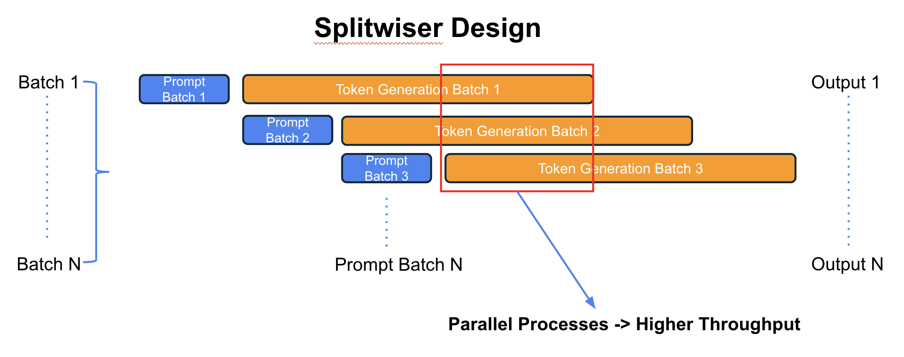

# Splitwiser | Efficient LLM Inference with Constrained Resources

This repository hosts the official PyTorch implementation of: [Splitwiser | Efficient LLM Inference with Constrained Resources](https://asad-aali.github.io/assets/pdf/paper_splitwiser.pdf).

<b>Authored by: </b>[Asad Aali](https://asad-aali.github.io/), Melissa Capo, Adney Cardoza<be>

<b>Contact: </b>asad.aali@utexas.edu<br>

<center>



</center>

## Abstract
*Efficient inference of LLMs remains a crucial challenge, with two main phases: a compute-intensive prompt computation and a memory-intensive token generation. Despite existing batching and scheduling techniques, token generation phases fail to fully utilize compute resources, especially when compared to prompt computation phases. To address these challenges, we propose Splitwiser, a methodology that splits the two phases of an LLM inference request onto the same GPU, thereby reducing overhead and improving memory access and cache utilization. By eliminating the need to transfer data across devices, Splitwiser aims to minimize network-related overheads. In this paper, we describe the basic structure of our proposed pipeline while sharing preliminary results and analysis. We implement our proposed multiprocessing design on two widely-used and independent LLM architectures: Huggingface and vLLM.*

Code written on top of the official implementation:<br>
[RadAdapt: Radiology Report Summarization via Lightweight Domain Adaptation of Large Language Models](https://arxiv.org/pdf/2305.01146.pdf)<br>

## Environment
Use these commands to set up a conda environment:
```
conda env create -f env/environment.yml -n splitwiser
conda activate splitwiser
```

## Usage
1. In `src/constants.py`, set your own project directory `DIR_PROJECT`.
2. Run a script, setting `model` and `case_id` as desired:
    - `run_discrete.sh`: discrete prompting output.
    - `run_discrete_mp.sh`: discrete prompting using [PyTorch Multiprocessing](https://pytorch.org/docs/stable/notes/multiprocessing.html).
    - `run_discrete_mps.sh`: discrete prompting using [NVIDIA MPS](https://docs.nvidia.com/deploy/mps/index.html).
4. To add your own dataset, follow the format in the folder `models/data/`.

## Citation
```
@article{patel2023splitwise,
  title={Splitwise: Efficient generative llm inference using phase splitting},
  author={Patel, Pratyush and Choukse, Esha and Zhang, Chaojie and Goiri, {\'I}{\~n}igo and Shah, Aashaka and Maleki, Saeed and Bianchini, Ricardo},
  journal={arXiv preprint arXiv:2311.18677},
  year={2023}
}
@article{van2023radadapt,
  title={RadAdapt: Radiology Report Summarization via Lightweight Domain Adaptation of Large Language Models},
  author={Van Veen, Dave and Van Uden, Cara and Attias, Maayane and Pareek, Anuj and Bluethgen, Christian and Polacin, Malgorzata and Chiu, Wah and Delbrouck, Jean-Benoit and Chaves, Juan Manuel Zambrano and Langlotz, Curtis P and others},
  journal={arXiv preprint arXiv:2305.01146},
  year={2023}
}
```
